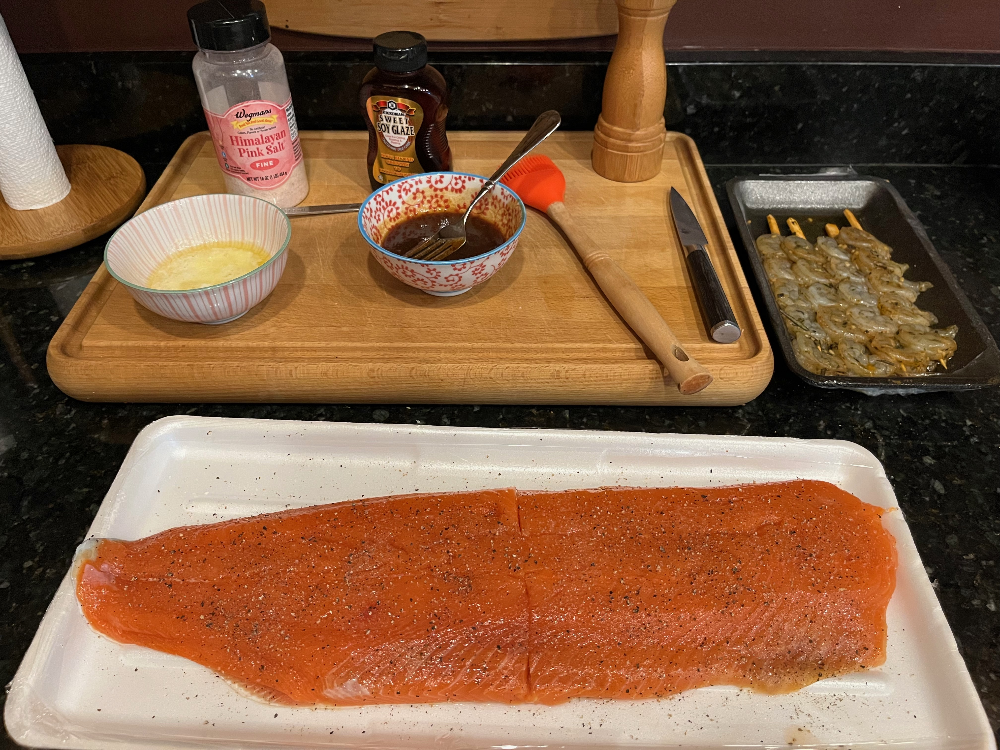
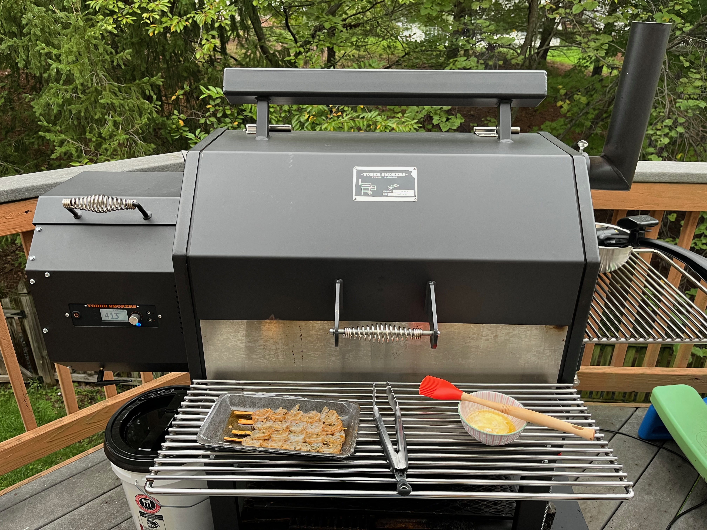
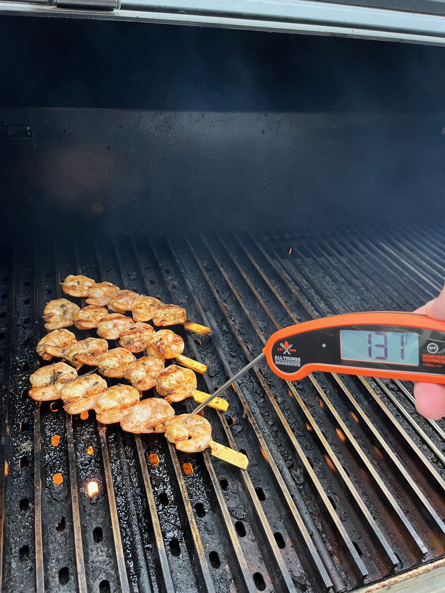
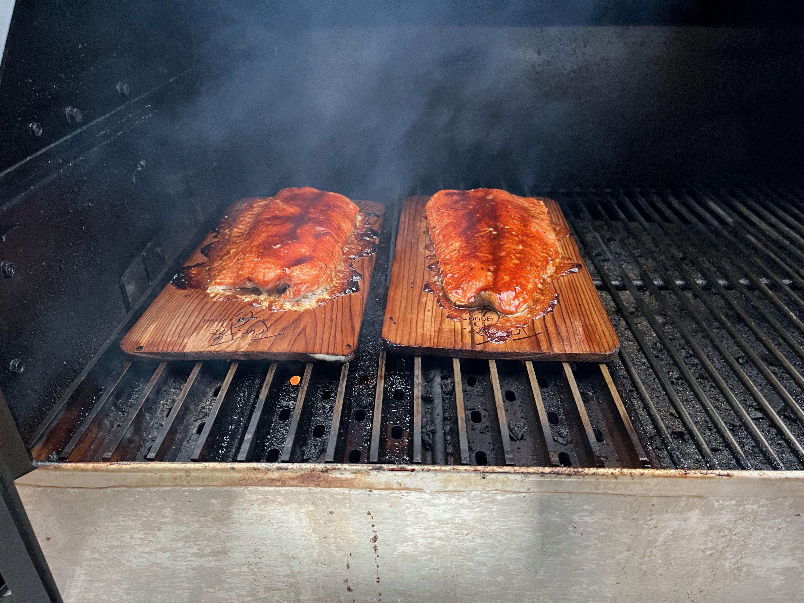
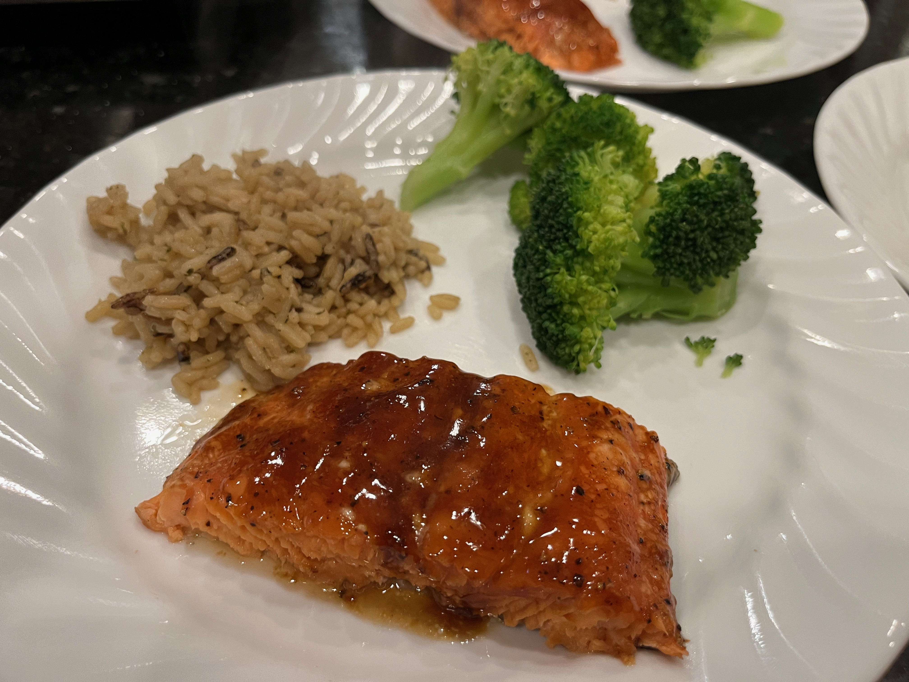

# I decided to change my cedar plank salmon up

And I figured this was a great time to share.  You know that salmon filet at the grocery store that comes on a cedar plank with a little tub of seasoning?  You throw it on the grill, toss the seasoning on the salmon, and the brown sugar melts and caramelizes all over the salmon while the cedar plank imparts its own notes.  It's wonderful.  Salmon in general is wonderful.  You can brine and cold smoke it, brine and hot smoke it, skip right to smoking it, grill it, use lemon and pepper, garlic and butter... the possibilities are limitless.

The easy button in my house used to be the brown sugar option until my son decided that was too sweet.  That means the maple syrup recipe I have will be too sweet as well.  So, tonight I changed it up.

## The ingredients (if you can call them that)

* 1 1/2 tsp salt
* fresh ground pepper
* 1/2 cup prepared glaze (1/4 cup melted butter mixed with 1/4 cup Kikkoman Sweet Soy Glaze)
* 2 lbs wild caught salmon
* Nevermind those scrumptious little shrimps over there.  These are not the shrimp you're looking for.

Use whatever salt you want.  This pink salt was on my counter top and I liked that it was a bit more coarse than Morton's salt.

*Farm raised fish are pumped full of hormones.  Genetically engineered farm raised fish take about half as long to reach maturity and full size compared to their ocean counterparts.  I'm sure all the crap that's pumped into them are within FDA regulated limits, but still.*

Maybe stick with wild caught salmon.

## Cook method

We're grilling over an open flame.  For this, I'm using the Yoder Smokers YS640S Pellet Grill because it has searing grates which can be placed directly over the open fire box turning this smoker into a wood fired grill.

I tossed some shrimp on for a snack while the rest of the food cooked.  FYI, normally I'd aim for pulling the shrimp at 120 deg.  Anyway...

## Steps

1. Soak the planks.  You want to make sure the planks are good and soaked so they don't catch fire.  Start this first to make sure the wood planks have had adequate time to hydrate.
1. Rinse and pat dry the salmon filet.
1. Salt the filets.  Hold the salt about a foot above the meat to get a nice and even sprinkle.
1. Add pepper, ideally with a pepper grinder, to taste.  Alternatively, you can toast whole peppercorns to make them aromatic and then crush them.
1. Add the filets to the planks and toss on a grill pre-heated to between 400-600 deg
1. Glaze the filets and cook, lid down, until the salmon reach 165 deg internal
    

## Eat

Dish up some salmon with a vegetable and starch of your choice, and enjoy!
